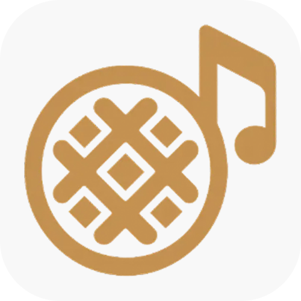

<div align="center">
  
</div>

# croffle-bot

Discord bot project using Go language.

using `discordgo` library, Implement the music playback function through 'ffmpeg' and 'yt-dlp'.

# 1. Project Goals

1. Controlling external processes with Go language concurrency and `os/exec`
2. Development of prototypes using the `dca` library
3. Remove `dca` and implement `ffmpeg` and streaming pipeline to configure modular bots
4. Build a consistent development and deployment environment with Docker & Docker Compose

---

## 2. Tech Stack

- **Language :** Go
- **Core Library :**
    - `github.com/bwmarrin/discordgo`: linked discord APO
    - `github.com/jonas747/dca`: discord audio incoding (For the initial prototype)
- **Audio processing :**`ffmpeg`, `yt-dlp`
- **Containers :** Docker, Docker Compose

---

## 3. Development Environment Settings

### 3.1. Native configuration settings

- **Git clone**

```bash
git clone <repository-url>
cd <repository-directory>
```

- Install required programs
    - **Go 1.25+:** Installing from [Official](https://go.dev/dl/)
    - **yt-dlp:** Install using `winget`, `apt`, and `dnf`
    - **ffmpeg:** Install using `winget`, `apt`, and `dnf`
-

```ini
BOT_TOKEN="YOUR_DISCORD_BOT_TOKEN_HERE"
# (Optional) Specific server ID to test the bot
GUILD_ID="YOUR_TEST_SERVER_ID_HERE"
```

- Install dependencies

```bash
go mod tidy
```

- Run a bot

```bash
cd cmd/croffle-bot
go run .
```

### 3.2. Docker Compose Env

- **Install Docker and create an&#x20;\*\***`.env`\***\*&#x20;file**
- **Run a bot**

```bash
docker compose up --build -d
```

- **Check logs**

```bash
docker compose logs -f
```

- Shut down

```bash
docker compose down
```

---

## 4. Development Roadmap

### &#x20;4.1. Initial Prototype (using dca)

- **Goals :** Use the `dca` library to implement basic music playback capabilities
- **Major Work:**
- &#x20;The `ffmpeg` and `yt-clp` controls are delegated to `dca`
- Implementing **Queue** Management
- **Implement playback control** (play, pause, skip, etc.)
- **Porcessing commands**: parsing and executing commands from discord messages
- **Main function:**
    - [ ] `!join`/`!leave`: Voice Channel join/leave
    - [ ] `!play <url>` / `!p <url>`: URL-based music playback
    - [ ] Managing a Queue(Song)
        - [ ] `!skip`: Skip the song that is currently playing
        - [ ] `!skipto [Queue Num]`: Even the song with a specific number. Skip the song (Skip all the song in the middle)
        - [ ] `!playnext <url>`: Next play (priority reservation)
        - [ ] `!pause`/`!resume`: Pause and resume playback
        - [ ] `!remove [Queue Num]`: Delete a list of specific numbers from the queue
        - [ ] `!clear`: Initialize the cue while leaving the song currently playing
        - [ ] `!stop`: Stop playback and queue initialization
        - [ ] `!queue` / `!list`: Output current queue list
    - [ ] Check information and status
        - [ ] `!help`: Output all the commands and usage that the bot has
        - [ ] `!ping`: Output the bot's current response rate (check latency)

### 4.2. Modularization and direct control of ffmpeg/yt-dlp

- **Goals:&#x20;**&#x52;emove `dca`, switch to direct control of `ffmpeg`and `yt-dlp`
- **Major Work:**
    - Directly manage `ffmpeg`and `yt-dlp`processes using the os/exec package.
    - Connect `ffmpeg`output stream to Discord audio stream via io.Pipe
    - Modularization of music playback logic (separation of music engine)
- **Major Features:&#x20;**
    - [ ] Remove the `dca`module and implement the `streaming` module
    - [ ] Implementing `yt-dlp`Wrapper
    - [ ] Implementation of `ffmpeg` pipeline control logic
    - [ ] Optimizing performance and reliability

---

## 5. Team Development Rules

5.**1. Branch Strategy**

- Github Flow: Each developer forks the main repository and develops and releases PRs.

  5.**2. Work Flow**

1. `fetch` from `upstream` to see if you have the latest code
2. Update the local `master` from the master in `upstream` (`merge`/`pull`)
3. Sync by pushing to `origin`, each developer's forked repository
4. Perform work by branching
5. Once development is complete, create a PR from `<user>/feat/<branch>`to `Team-Croffle/master`

5.**3. Commit Convention**

- `feat`: Add features
- `fix`: Bug fix
- `docs`: Documentation modifications (README, etc.)
- `refactor`: Code Refactoring
- `style`: Modify code style (formatting)
